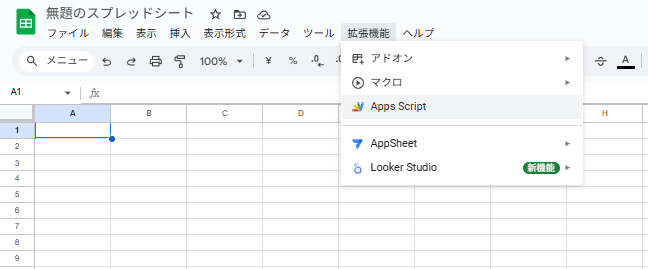
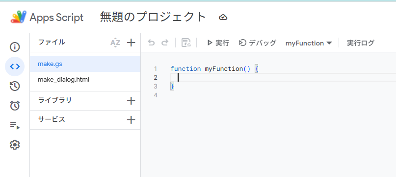
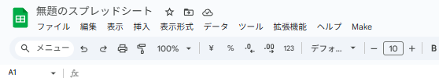
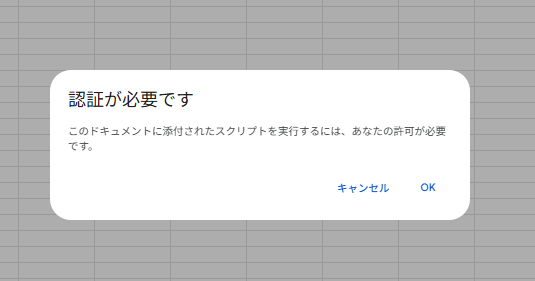
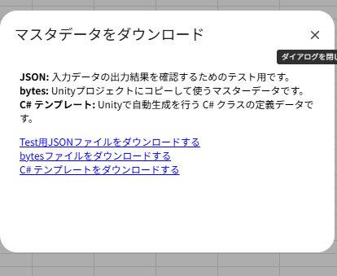
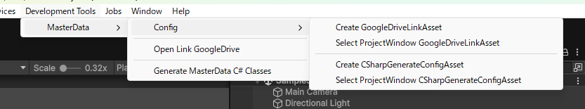
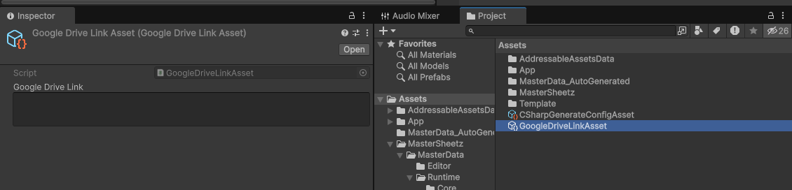
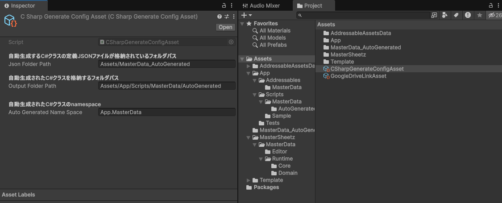

# MasterSheetz
マスターデータの基盤システム

## 概要

マスタデータの定義　-> Unityに組み込む -> ランタイムで利用するまでのフローを高速に、簡単に行うことを目指したライブラリです。

入力したデータの変換をするGoogleSpreadSheetのスクリプト、マスタデータの利用するUnity用のパッケージを提供しています。

マスタデータでサポートしている型は、```int```, ```string```, ```bool```の3つの型です。

# GoogleSpreadSheetについて

## AppScriptsのセットアップ
### 1.```拡張機能 > AppScript``` から、```make.gs``` ```make_dialog.html```の、2ファイルを作成します。



### 2.作成したスクリプトファイルにコードをコピーする
[GoogleSpreadSheetAppScripts](/GoogleSpreadSheetAppScripts/) に配置されているファイルの中身を作成したAppScriptsの```make.gs/make_dialog.html```にコピーし、保存をします。

スプレッドシートのメニューに"make"が追加されていることを確認してください。


### 3.認証をする
初回のみ実行する際に、スクリプトを実行を許可するための認証をする必要があります。
"make"を実行すると、```認証が必要です```というダイアログが表示されるので、"OK"をクリックします。



__以下の手順で進んでください。__

1. Googleにログイン
2. 詳細をクリック
3. make（安全ではないページ）をクリック
4. "make が Google アカウントへのアクセスを求めています"という内容のダイアログが表示されます。
5. "すべて選択"にチェック
5. 続行をクリック
6. "マスタデータをダウンロード"というダイアログが表示される



## データ入力について
1. 1行目は __"カラムに対してのコメント"__ を記載できます。makeをする際に無視されます。
2. 2行目は, __カラムの型__ を入力してください。サポートしている型は、```int```, ```string```, ```bool```の3つの型です。
3. 3行目は、__カラム名__ を入力してください。
4. 4行目以降は、データを追加してください。

> [!NOTE]
> __"ignore"__のカラムをを追加すると、__データに対してのコメント__ を記載できます。makeをする際に無視されます。

[マスタデータのサンプル](https://docs.google.com/spreadsheets/d/e/2PACX-1vTGAtbQ8Q2sIzgk-BoAc0drG9_zG23Z1e25A6KYnTPiecpJOkRkQ_YNkbt0Ku1HzP3eXLfCz8lvEkeS/pubhtml)

## makeでダウンロードするファイルの中身について
### Test用のJSON

入力されたデータの確認ができます。以下は、Test用のJSONの出力結果です。
```
{
	"fileName": "SampleCharacter",
	"types": [
		"int",
		"string",
		"int",
		"bool"
	],
	"columns": [
		"id",
		"name",
		"type",
		"playable"
	],
	"root": [
		{
			"id": 1001,
			"name": "Pika",
			"type": 1,
			"playable": true
		},
		{
			"id": 1002,
			"name": "Hito",
			"type": 2,
			"playable": false
		},
		{
			"id": 1003,
			"name": "Dane",
			"type": 3,
			"playable": false
		}
	]
}
```

### bytesファイル

Unityにコピーするマスタデータの成果物です。以下の"root"のデータがバイナリフォーマットで入っています。
```
	"root": [
		{
			"id": 1001,
			"name": "Pika",
			"type": 1,
			"playable": true
		},
		{
			"id": 1002,
			"name": "Hito",
			"type": 2,
			"playable": false
		},
		{
			"id": 1003,
			"name": "Dane",
			"type": 3,
			"playable": false
		}
	]
```

### C#のテンプレート

UnityでマスタデータのC#クラスを自動生成する際に利用するJSONファイルです。JSONの内容は以下のようになっています。
```
{
	"fileName": "SampleCharacter",
	"types": [
		"int",
		"string",
		"int",
		"bool"
	],
	"columns": [
		"id",
		"name",
		"type",
		"playable"
	]
}
```
# Unity

## セットアップ
※ "Addressables" と "UniTask" の導入が必須です。


PackageManager > Add package from git URL...から追加
```

```

## エディタメニュー
MenuItemの __Developmet Tools > MasterData__から実行できます。



## GoogleDriveの設定
```Config > Create GoogleDriveLinkAsset```
GoogleDriveLinkAssetを作成します。

```Config > Select ProjectWindow GoogleSpreadSheetAsset```
ProjectWindowでGoogleDriveLinkAsset選択状態にします。



__Open Link GoogleDrive__ から, 上記のアセットに設定したURLへ飛ぶことができます。


## 自動生成するマスタデータのC#クラスの設定
```Config > Create CSharpGenerateConfigAsset```
CSharpGenerateConfigAssetを作成します。

```Config > Select ProjectWindow CSharpGenerateConfigAsset```
ProjectWindowでCSharpGenerateConfigAsset選択状態にします。

CSharpGenerateConfigAssetには、以下の内容を設定します。


__Generate MasterData C# Classes__を実行すると, ```OutputFolderPath```内にC#クラスを生成します。

> [!CAUTION]
> 実行する際に、すでに存在するファイルをすべて削除したうえで、Jsonの定義に基づいて再生成します。
> OutputFolderPath以下には、手動で追加したファイルを追加しないようにしてください。

## ロード処理
```IMasterDataLoader```と```MasterDataTextAssetLoaderBase```を、継承したクラスを実装してください。

以下は、サンプルです。
```
// bytesファイルは、"SampleCharacter"をキーにして、Addressablesに登録をしています。

public class MasterDataLoader : MasterDataTextAssetLoaderBase, IMasterDataLoader
{
    public async UniTask<List<MasterDataTableBase>> LoadAll()
    {
        await UniTask.WhenAll(
            LoadAndRegisterAsync<SampleCharacter>(nameof(SampleCharacter), data => new SampleCharacterMasterDataTable(data))
        );
        return Tables;
    }
}
```

以下のようにリポジトリを生成をしてください。
```
var repository = new MasterDataRepository(new MasterDataLoader());
await repository.LoadAsync();
```

## データの取得
テーブルの取得はMasterDataRepositoryの```GetTable()```を利用してください。
テーブルからのデータ取得は、```GetById(int id)```, ```GetAll()```を```MasterDataTable```クラスが実装しています。
以下のはサンプルです。
```
var sampleCharacterTable = repository.GetTable<SampleCharacterMasterDataTable>();
var data = sampleCharacterTable.GetById(1001);
var dataList = sampleCharacterTable.GetAll();
```

[!NOTE]
> 自動生成されるTableクラスはpartialになっているので、容易に拡張機能を実装することができます。

以下は、拡張機能のサンプルです。
```
// typeをEnumで取得する
public static class SampleCharacterExtension
{
    public static SampleCharacterType GetType(this SampleCharacter character)
    {
        return (SampleCharacterType)character.Type;
    }
}

// Enumにしたtypeから一致するデータのみ取得をする
public partial class SampleCharacterMasterDataTable : MasterDataTable<SampleCharacter>
{
    public List<SampleCharacter> GetByType(SampleCharacterType type)
    {
        var data = GetAll();
        return data.Where(x => x.Type == (int)type).ToList();
    }
}
```

# ライセンス
本ソフトウェアはMITライセンスで公開しています。